Sistema de Cobranças
Sistema web para automação de cobranças e gestão de recebíveis para pequenas e médias empresas. Desenvolvido com Node.js, Express, SQLite e React 18.

Visão Geral
O sistema cobre o ciclo completo de cobranças: cadastro de clientes, emissão de cobranças com links Pix, envio automático de lembretes por WhatsApp e email, análise de risco com inteligência artificial, relatórios exportáveis e controle de acesso por usuários.
Integrações externas são opcionais. Sem nenhuma chave configurada, o sistema funciona em modo mock, mensagens são exibidas no console e links Pix são simulados localmente. Cada integração pode ser ativada individualmente adicionando a chave correspondente no arquivo .env.

Stack
Backend

Node.js 20 com Express 4
SQLite via sqlite3 (sem compilação nativa)
Autenticação JWT com bcryptjs
Validação de input com Zod
Rate limiting com express-rate-limit
Agendamento com node-cron
Email com nodemailer (suporte Resend e SMTP)

Frontend

React 18 com React Router v6
CSS puro com variáveis (sem framework de UI)
Fonte Inter + JetBrains Mono

Integrações externas (todas opcionais)

Claude (Anthropic) — mensagens personalizadas e análise de risco
Z-API ou Twilio — envio real de WhatsApp
Resend ou Gmail SMTP — envio real de email
Asaas — cobranças Pix reais com confirmação automática via webhook

Instalação e Execução Local
Pré-requisitos: Node.js 18 ou superior.
bash# Backend
cd backend
npm install
cp .env.example .env     # editar com suas chaves
npm run seed             # inserir dados de exemplo (opcional)
npm run dev              # inicia em http://localhost:3001

# Frontend (outro terminal)
cd frontend
npm install
npm start                # abre em http://localhost:3000
Ao iniciar, o terminal exibe o status de cada integração:
Cobrancas API v4 em http://localhost:3001
IA: Claude ativado (ou: Configure ANTHROPIC_API_KEY)
WhatsApp: mock (ou: zapi / twilio)
Email: resend (ou: mock / smtp)
Pix: mock (ou: asaas)
Auth: JWT ativo — login: admin@empresa.com / admin123

Variáveis de Ambiente
Copie backend/.env.example para backend/.env e preencha conforme necessário. Nenhuma variável é obrigatória para o sistema funcionar em modo de desenvolvimento.
VariávelDescriçãoObrigatóriaANTHROPIC_API_KEYChave da API Claude ativa IA no sistemaNãoZAPI_INSTANCE_ID / ZAPI_TOKENCredenciais Z-API para WhatsApp realNãoTWILIO_ACCOUNT_SID / TWILIO_AUTH_TOKENCredenciais Twilio para WhatsAppNãoRESEND_API_KEYChave Resend para email realNãoEMAIL_HOST / EMAIL_USER / EMAIL_PASSConfiguração SMTP alternativaNãoASAAS_API_KEYChave Asaas para cobranças Pix reaisNãoASAAS_SANDBOXtrue para ambiente de testes do AsaasNãoJWT_SECRETSegredo para assinar tokens JWTRecomendado em produçãoBASE_URLURL pública do servidor (usada nos links Pix)Recomendado em produçãoFRONTEND_URLOrigem permitida pelo CORSRecomendado em produçãoCOMPANY_NAMENome da empresa exibido nos emailsNãoPIX_KEYChave Pix exibida na página de pagamento mockNão

API — Endpoints Principais
Todos os endpoints exceto /auth/login, /health e /pix/:token exigem o header:
Authorization: Bearer <token>
Autenticação
POST   /auth/login           Login — retorna token JWT
GET    /auth/me              Dados do usuário autenticado
GET    /auth/users           Lista usuários (admin)
POST   /auth/users           Criar usuário (admin)
PATCH  /auth/password        Alterar própria senha
Clientes
GET    /customers            Lista com totais financeiros (suporta ?search=)
POST   /customers            Criar cliente (com cobrança inicial opcional)
GET    /customers/:id        Detalhe com todas as cobranças
PATCH  /customers/:id        Editar dados do cliente
DELETE /customers/:id        Remover cliente e cobranças (cascade)
POST   /customers/import     Importar array de clientes em bulk
Cobranças
GET    /payments             Lista (filtros: ?status= ?from= ?to= ?search=)
POST   /payments             Criar cobrança + link Pix automático
PATCH  /payments/:id/status  Atualizar status
DELETE /payments/:id         Remover cobrança
Recorrências
GET    /recurrences          Lista de cobranças recorrentes
POST   /recurrences          Criar recorrência (gera primeira cobrança)
PATCH  /recurrences/:id/toggle  Pausar / ativar
DELETE /recurrences/:id      Remover
Dashboard e Relatórios
GET    /dashboard            Resumo financeiro + próximos vencimentos + gráfico mensal
GET    /dashboard/messages   Histórico de mensagens (últimas 100)
GET    /reports/summary      Resumo por período (?from= ?to=)
GET    /reports/export/csv   Download CSV (?from= ?to= ?status= &token=)
GET    /reports/export/pdf   Download PDF para impressão (&token=)
Inteligência Artificial
GET    /ai/status            Status de todas as integrações
GET    /ai/risk              Análise de risco da carteira (requer Claude)
POST   /ai/chat              Chat em linguagem natural sobre os dados
POST   /ai/message/:id       Gerar mensagem personalizada para uma cobrança
Outros
GET    /health               Health check com status do banco e IA
GET    /pix/:token           Página pública de pagamento Pix
POST   /webhooks/asaas       Webhook de confirmação de pagamento (Asaas)
GET    /settings             Configurações da empresa
PATCH  /settings             Salvar configurações

Banco de Dados
SQLite com WAL mode e foreign keys habilitados. Schema criado automaticamente na primeira execução. Migrations seguras (ALTER TABLE com try/catch) permitem atualizar o banco sem perda de dados.
Tabelas

users — usuários com perfis admin e operator
customers — clientes com nome, telefone, email, CPF/CNPJ e notas
payments — cobranças com status, vencimento e referência a recorrência
recurrences — configuração de cobranças mensais automáticas
pix_links — links de pagamento com token único e expiração
message_logs — histórico de todas as mensagens enviadas
settings — configurações da empresa em chave/valor

Scheduler
Executa a cada hora via node-cron. A cada execução:

Atualiza cobranças com due_date < hoje de pending para overdue
Envia lembrete 2 dias antes do vencimento (WhatsApp + email)
Envia aviso no dia do vencimento
Envia cobrança de atraso para todas as cobranças overdue
Deduplica envios — uma mensagem por tipo por cobrança por dia

Adicionalmente, executa diariamente às 6h para gerar cobranças do mês corrente a partir das recorrências ativas.
Se ANTHROPIC_API_KEY estiver configurada, cada mensagem é gerada pela IA com tom ajustado ao histórico de atraso do cliente. Caso contrário, usa templates estáticos.

Perfis de Acesso
PerfilPermissõesadminAcesso total — inclui usuários, configurações e relatóriosoperatorClientes, cobranças, recorrências, dashboard e mensagens

Docker
bashdocker-compose up --build
Frontend disponível em http://localhost:3000, backend em http://localhost:3001. O banco de dados é persistido em volume nomeado (db_data).
Para produção, ajustar no docker-compose.yml:

BASE_URL para a URL pública do servidor
FRONTEND_URL para a URL do frontend
JWT_SECRET para um segredo forte
ASAAS_SANDBOX=false se usando Pix em produção

Compartilhar com Outros Usuarios na Rede
Para acesso na mesma rede local, descubra o IP da máquina com ipconfig (Windows) e acesse http://SEU_IP:3000.
Para acesso remoto sem servidor, o Tailscale (tailscale.com) cria uma rede privada gratuita entre dispositivos. Instale em ambas as máquinas, faça login na mesma conta, e acesse pelo IP Tailscale.

Proximos Passos
Os itens abaixo estao priorizados por impacto no produto e complexidade de implementacao.
Prioridade alta

Layout responsivo completo — o sistema foi desenvolvido para desktop. Adicionar breakpoints para tablets e mobile, com sidebar colapsavel em telas menores.
Portal do cliente — pagina publica acessada por link unico onde o cliente visualiza todas as suas cobranças, status e botao de pagamento, sem precisar de conta no sistema.
Opt-out de mensagens — campo opted_out na tabela de clientes e logica no scheduler para nao enviar mensagens a clientes que solicitaram saida. Exigido pela politica do WhatsApp Business.
Normalizacao de telefone para E.164 — ao salvar um cliente, converter o numero para o formato +5511999999999 automaticamente. Necessario para que o Z-API e Twilio funcionem corretamente sem ajuste manual.

Prioridade media

Regua de cobrança configuravel — substituir o scheduler fixo (D-2, D0, Doverdue) por uma sequencia configuravel pelo usuario: quantos dias antes avisar, com qual frequencia repetir o aviso de atraso, e em qual canal (WhatsApp, email ou ambos).
Importacao de planilha com cobranças — atualmente a importacao CSV cria apenas clientes. Expandir para aceitar colunas de cobrança (valor, vencimento, descricao) e criar cliente + cobrança em uma operacao.
Paginacao nos endpoints — GET /customers e GET /payments retornam todos os registros. Adicionar ?page=&limit= para suportar carteiras grandes sem impacto de performance.
Busca global expandida — a busca atual filtra apenas clientes. Incluir cobranças e mensagens nos resultados.
Notificacoes em tempo real — substituir o polling de 60 segundos no dashboard por WebSocket (Socket.io). Quando um pagamento for confirmado via webhook do Asaas, o dashboard atualiza instantaneamente.

Prioridade baixa

Consulta de CPF/CNPJ e negativacao — integracao com Serasa ou SPC para consultar inadimplencia antes de fechar negocio, e negativacao automatica apos X dias em atraso configuravel.
Boleto bancario — o Asaas ja suporta boleto. Adicionar billingType: 'BOLETO' como opcao de cobrança para clientes que preferem boleto a Pix.
Relatorios avancados — previsao de caixa para os proximos 30/60/90 dias baseada em cobranças pendentes e historico de pagamento de cada cliente, gerada pela IA.
Multi-empresa (SaaS) — adicionar coluna company_id em todas as tabelas e isolamento por tenant. Permite hospedar uma instancia do sistema para multiplos clientes pagantes.
Aplicativo mobile — React Native reutiliza a maior parte da logica de negocio e da API. Prioridade baixa porque o sistema ja funciona bem no browser mobile.

Credenciais Padrao
Email:  admin@empresa.com
Senha:  admin123
Altere a senha imediatamente apos o primeiro acesso em Configuracoes > Alterar senha.

## Screenshots

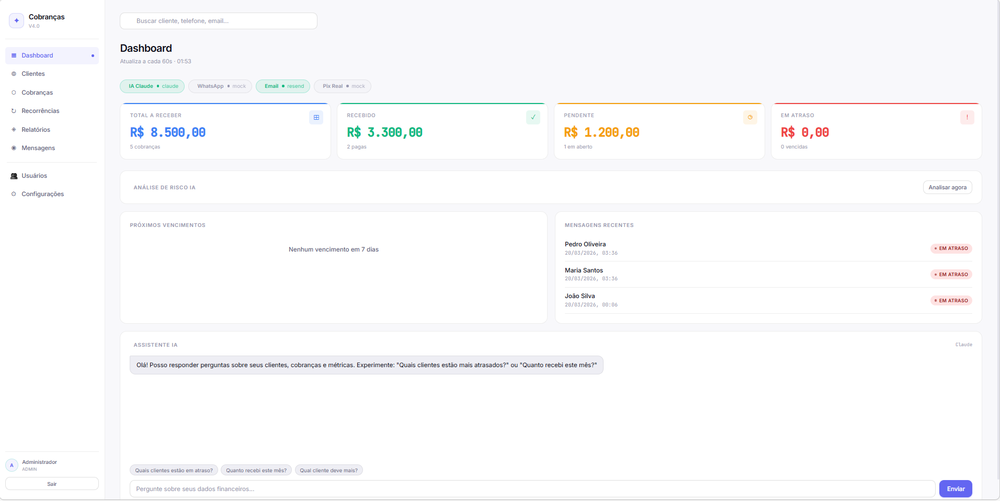

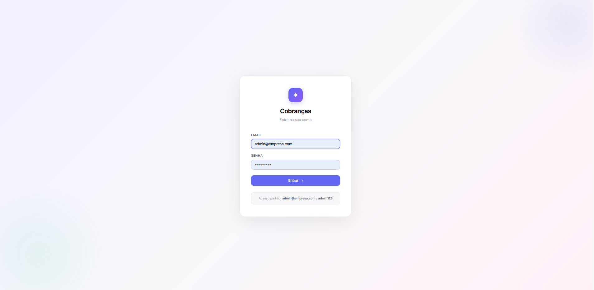

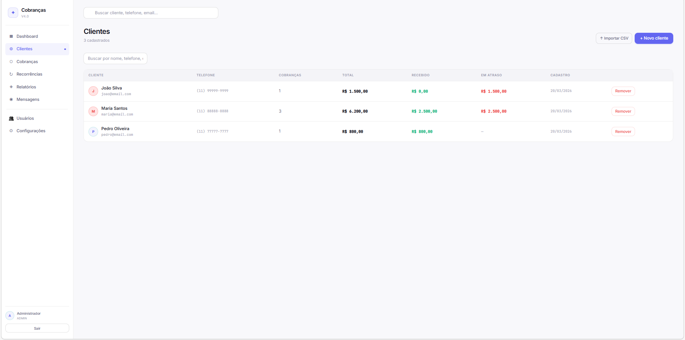

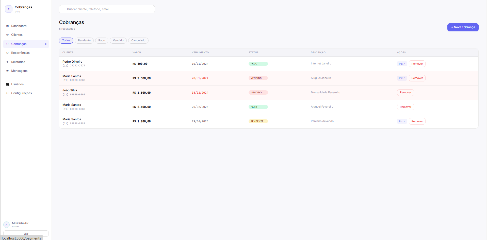

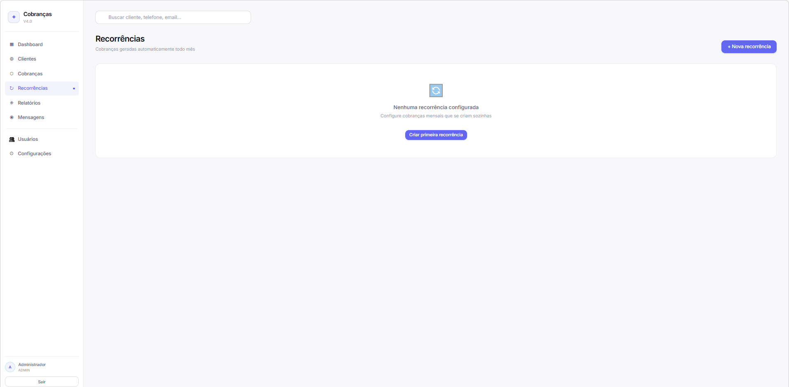

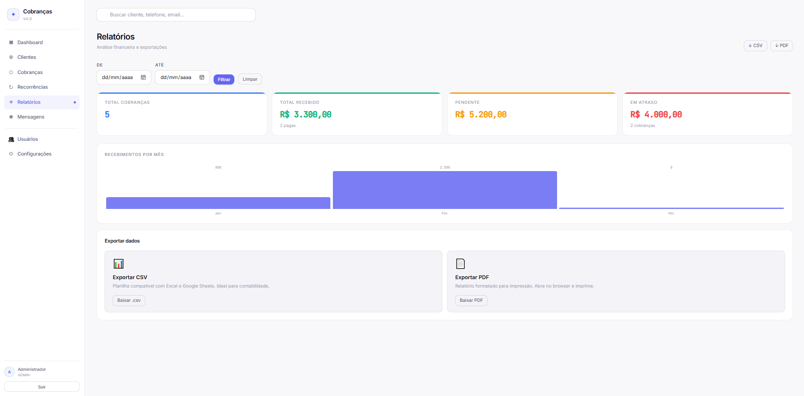

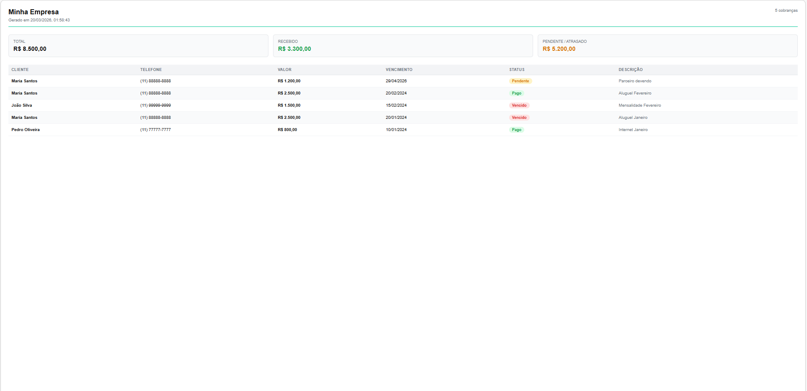

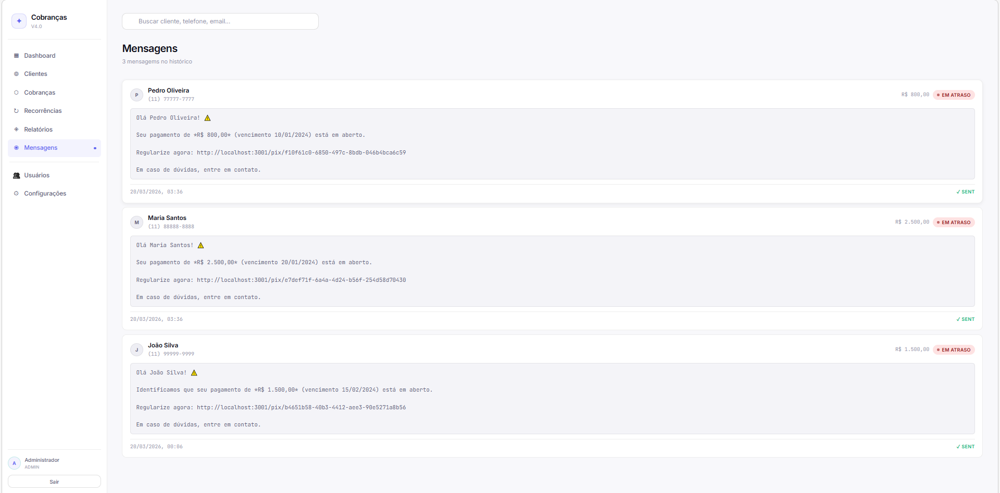

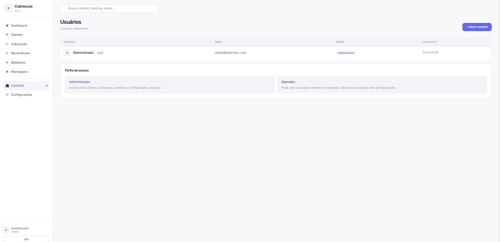

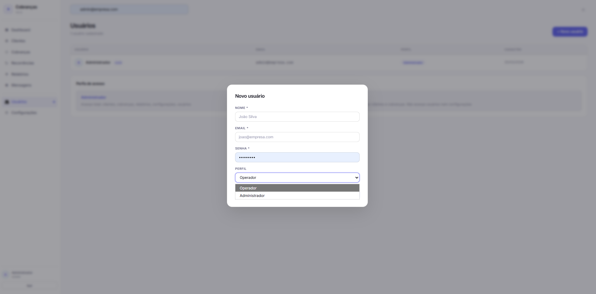

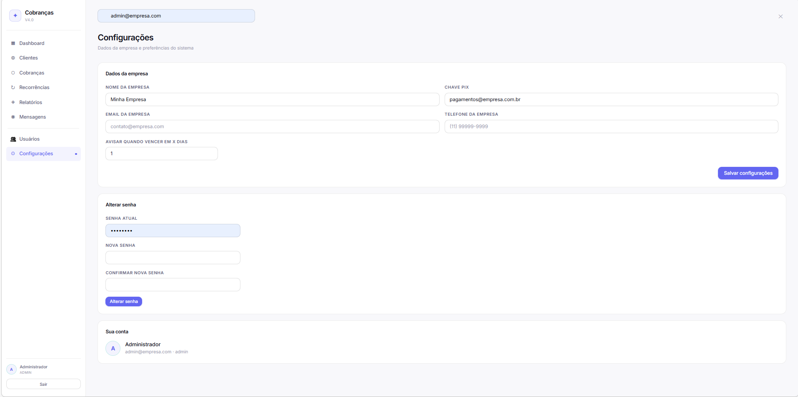
